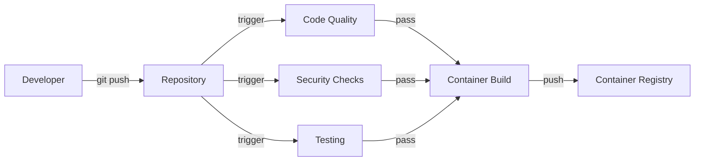
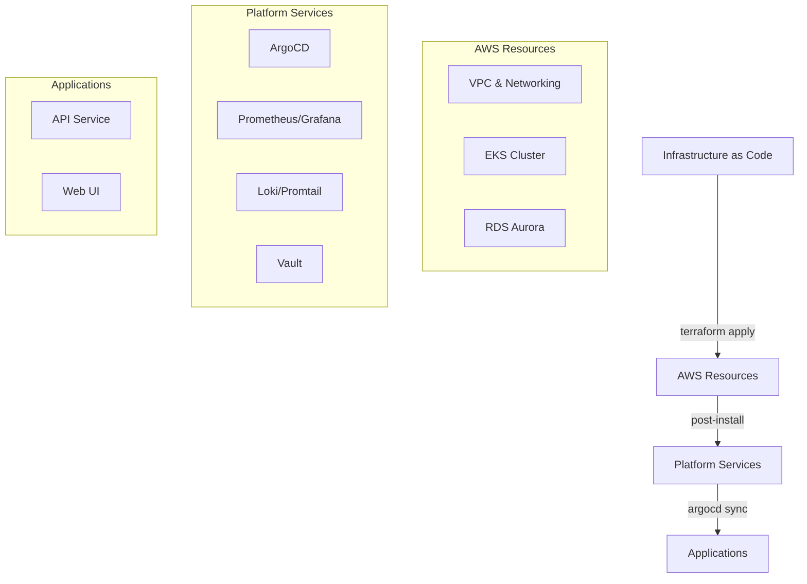

> ### ⚠️ Disclaimer
>
>  This is a pet project focused on practical DevOps implementation using AWS services and modern CI/CD practices. The infrastructure prioritizes development experience and learning opportunities over enterprise-grade configurations and high availability. All cost-optimization decisions are intentional for educational purposes.

---

# 🏗️ Three-Tier Architecture on AWS

[](https://github.com/thejondaw/devops-pet-project/actions/workflows/ci-backend.yaml)
[](https://github.com/thejondaw/devops-pet-project/actions/workflows/ci-frontend.yaml)
[](https://github.com/thejondaw/devops-pet-project/actions/workflows/cd-infrastructure.yaml)
[](https://github.com/thejondaw/devops-pet-project/actions/workflows/cd-applications.yaml)

CI/CD implementation of a three-tier architecture leveraging modern DevOps practices, Infrastructure as Code, and GitOps methodologies.

## 🏛️ Application Architecture

The project implements a classic three-tier architecture with modern cloud-native enhancements:

```
┌──────────────────────────────────────────────────────────┐
│                            VPC                           │
│ ┌──────────────────────────────────────────────────────┐ │
│ │                 (2x PRIVATE SUBNETS)                 │ │
│ │   ┌──────────────────────────────────────────────┐   │ │
│ │   │               TIER I - DATABASE              │   │ │
│ │   └───┐ ┌─────────┐ ┌──────────┐ ┌─────────┐ ┌───┘   │ │
│ │        │           │            │           │        │ │
│ │     DB_NAME     DB_PORT      DB_USER     DB_PASS     │ │
│ │        │           │            │           │        │ │
│ │        ▼           ▼            ▼           ▼        │ │
│ │ ╔═════╣ ╠═════════╣ ╠══════════╣ ╠═════════╣ ╠═════╗ │ │
│ │ ║                                                  ║ │ │
│ │ ║                   (EKS CLUSTER)                  ║ │ │
│ │ ║                                                  ║ │ │
│ │ ║  ┌──┘ └─────────┘ └──────────┘ └─────────┘ └──┐  ║ │ │
│ │ ║  │               TIER II - API                │  ║ │ │
│ │ ║  └─────────┐ ┌────────────────────┐ ┌─────────┘  ║ │ │
│ │ ║             ▲                      ▲             ║ │ │
│ │ ║             │                      │             ║ │ │
│ └─║───────────┤ │ ├──────────────────┤ │ ├───────────║─┘ │
│   ║             │                      │             ║   │
│   ║          API_HOST               API_PORT         ║   │
│   ║             │                      │             ║   │
│ ┌─║───────────┤ │ ├──────────────────┤ │ ├───────────║─┐ │
│ │ ║             │ (2x PUBLIC  SUBNETS) │             ║ │ │
│ │ ║  ┌─────────┘ └────────────────────┘ └─────────┐  ║ │ │
│ │ ║  │                TIER III - WEB              │  ║ │ │
│ │ ║  └─────────────────────┐ ┌────────────────────┘  ║ │ │
│ │ ║                                                  ║ │ │
│ │ ╚══════════════════════╣  ▲  ╠═════════════════════╝ │ │
│ └────────────────────────┐  │  ┌───────────────────────┘ │
│                          │  │  │                         │
└──────────────────────────┘  │  └─────────────────────────┘
                              │
                            CLIENT
```

Each tier is containerized and deployed to EKS with dedicated responsibilities:

1. **Frontend Tier (Web Service)**
   - Serves static content and UI
   - Handles user interactions
   - Proxies requests to API
   - Environment Variables:
     - `PORT`: 4000
     - `API_HOST`: API service endpoint

2. **Backend Tier (API Service)**
   - Processes business logic
   - Manages database interactions
   - Handles data validation
   - Environment Variables:
     - `PORT`: 3000
     - `DBUSER`: Database username
     - `DBPASS`: Database password
     - `DBHOST`: Database endpoint
     - `DBPORT`: 5432
     - `DB`: Database name

3. **Database Tier (PostgreSQL)**
   - Standalone PostgreSQL 17.2 on `t4g.micro` instance
   - Cost-effective GP2 storage configuration
   - Basic daily backup retention
   - Single-AZ deployment for development purposes
   - Custom parameter group for enhanced logging

## 🔄 CI/CD Pipeline Implementation

This project demonstrates a comprehensive CI/CD approach following best practices:

### 🔨 Continuous Integration (CI) Pipeline

This CI process ensures code quality and security before containerization:



1. **Code Quality Gates**
   - ESLint (`.eslintrc`) validates code style
   - Prettier enforces consistent formatting
   - SonarQube performs deep code analysis
   - Unit & Integration test coverage

2. **Security Validation**
   - Dependencies audit
   - Trivy container scanning
   - SAST through SonarQube
   - Infrastructure code validation

3. **Artifact Generation**
   - Multi-stage Docker builds
   - Alpine-based images for minimal attack surface
   - Automated versioning and tagging
   - Container signing and verification

### 🚀 Continuous Delivery/Deployment (CD) Pipeline

This CD implementation consists of three major phases:



1. **Infrastructure Provisioning (IaC)**
   - TFLint validation for infrastructure code
   - AWS-specific rule checking
   - Deprecated resource detection
   - Best practices enforcement
   - Automated formatting and documentation

2. **Platform Tools**
   - GitOps with ArgoCD
   - Monitoring (Prometheus + Grafana)
   - Logging (Loki + Promtail)
   - Network (Falco)
   - Secrets (Vault)
   - Ingress (NGINX)

3. **Application Deployment**
   - Automated YAML formatting & syntax verification
   - Declarative configs in Git
   - Automatic sync via ArgoCD
   - Zero-touch deployment
   - Automated rollbacks

<div align="center">
  
</div>

## 📋 Implementation Progress

### ⚙️ Local Development
- [x] Linux environment setup
- [x] PostgreSQL configuration
- [x] Application runtimes
- [x] Development workflow

### 🔄 CI Pipeline
- [x] Code quality automation
- [x] Test frameworks
- [x] Security scanning
- [x] Container builds

### 🏗️ AWS Infrastructure
- [x] VPC & Networking
- [x] EKS deployment
- [x] RDS configuration

### ⚡ Platform Services
- [x] ArgoCD installation
- [x] Monitoring stack
- [x] Logging pipeline
- [x] Secrets management
- [x] Security monitoring

### 🚀 Applications
- [x] API service deployment
- [x] Web UI deployment

## 📁 Project Structure

```
devops-pet-project/
├── .github/workflows/          # CI/CD pipeline definitions
├── apps/                       # Application source code
│   ├── api/                    # Backend service
│   └── web/                    # Frontend application
├── helm/                       # Kubernetes package configs
├── terraform/                  # Infrastructure as Code
│   ├── modules/                # Reusable IaC components
│   └── environments/           # Environment configurations
├── k8s/                        # Kubernetes resources & ArgoCD
└── scripts/                    # Automation utilities
```

## 🛠️ Environment Configuration

Required variables in `terraform.tfvars`:

```hcl
region         = "your-region"
backend_bucket = "your-bucket"
environment    = "dev" "stage" "prod"

db_configuration = {
  name     = "name-of-db"
  username = "username"
  password = "password"
  port     = 5432
}
```

## 📚 Documentation

- [Local Test Readme](docs/local-tests.md)
- [Applications Configuration Readme](docs/README.md)

<div align="center">
  
</div>
