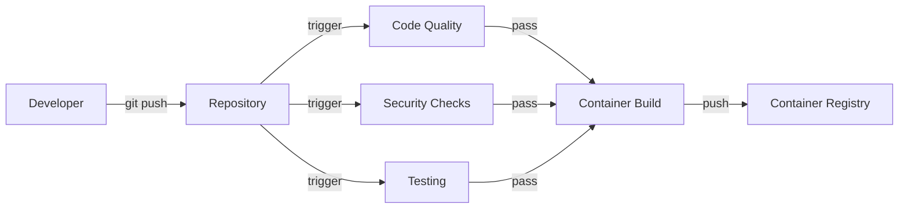
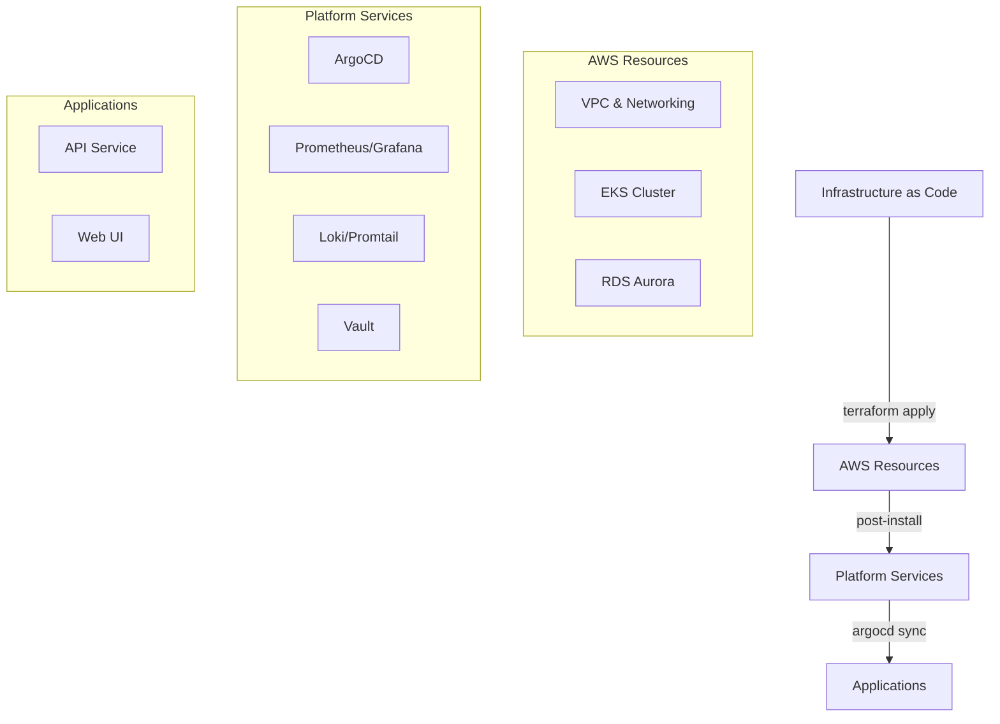

# 🏗️ Enterprise-Grade Three-Tier Architecture on AWS

[](https://github.com/thejondaw/devops-project/actions/workflows/ci-api.yaml)
[](https://github.com/thejondaw/devops-project/actions/workflows/ci-web.yaml)
[](https://github.com/thejondaw/devops-project/actions/workflows/cd-infrastructure.yaml)
[](https://github.com/thejondaw/devops-project/actions/workflows/post-install.yaml)
[](https://sonarcloud.io/summary/new_code?id=thejondaw_devops-project)

Production-ready implementation of a three-tier architecture leveraging modern DevOps practices, Infrastructure as Code, and GitOps methodologies.

## 🏛️ Application Architecture

The project implements a classic three-tier architecture with modern cloud-native enhancements:

```
┌──────────────────────────────────────────────────────────┐
│                            VPC                           │
│ ┌──────────────────────────────────────────────────────┐ │
│ │                 (2x PRIVATE SUBNETS)                 │ │
│ │   ┌──────────────────────────────────────────────┐   │ │
│ │   │               TIER I - DATABASE              │   │ │
│ │   └───┐ ┌─────────┐ ┌──────────┐ ┌─────────┐ ┌───┘   │ │
│ │        │           │            │           │        │ │
│ │     DB_NAME     DB_PORT      DB_USER     DB_PASS     │ │
│ │        │           │            │           │        │ │
│ │        ▼           ▼            ▼           ▼        │ │
│ │ ╔═════╣ ╠═════════╣ ╠══════════╣ ╠═════════╣ ╠═════╗ │ │
│ │ ║                                                  ║ │ │
│ │ ║                   (EKS CLUSTER)                  ║ │ │
│ │ ║                                                  ║ │ │
│ │ ║  ┌──┘ └─────────┘ └──────────┘ └─────────┘ └──┐  ║ │ │
│ │ ║  │               TIER II - API                │  ║ │ │
│ │ ║  └─────────┐ ┌────────────────────┐ ┌─────────┘  ║ │ │
│ │ ║             ▲                      ▲             ║ │ │
│ │ ║             │                      │             ║ │ │
│ └─║───────────┤ │ ├──────────────────┤ │ ├───────────║─┘ │
│   ║             │                      │             ║   │
│   ║          API_HOST               API_PORT         ║   │
│   ║             │                      │             ║   │
│ ┌─║───────────┤ │ ├──────────────────┤ │ ├───────────║─┐ │
│ │ ║             │ (2x PUBLIC  SUBNETS) │             ║ │ │
│ │ ║  ┌─────────┘ └────────────────────┘ └─────────┐  ║ │ │
│ │ ║  │                TIER III - WEB              │  ║ │ │
│ │ ║  └─────────────────────┐ ┌────────────────────┘  ║ │ │
│ │ ║                                                  ║ │ │
│ │ ╚══════════════════════╣  ▲  ╠═════════════════════╝ │ │
│ └────────────────────────┐  │  ┌───────────────────────┘ │
│                          │  │  │                         │
└──────────────────────────┘  │  └─────────────────────────┘
                              │
                            CLIENT
```

Each tier is containerized and deployed to EKS with dedicated responsibilities:

1. **Frontend Tier (Web Service)**
   - Serves static content and UI
   - Handles user interactions
   - Proxies requests to API
   - Environment Variables:
     - `PORT`: 4000
     - `API_HOST`: API service endpoint

2. **Backend Tier (API Service)**
   - Processes business logic
   - Manages database interactions
   - Handles data validation
   - Environment Variables:
     - `PORT`: 3000
     - `DBUSER`: Database username
     - `DBPASS`: Database password
     - `DBHOST`: Aurora endpoint
     - `DBPORT`: 5432
     - `DB`: Database name

3. **Database Tier (Aurora PostgreSQL)**
   - Serverless v2 for auto-scaling
   - Multi-AZ deployment
   - Automated backups
   - Encrypted at rest and in transit

## 🔄 CI/CD Pipeline Implementation

This project demonstrates a comprehensive CI/CD approach following enterprise best practices:

### 🔨 Continuous Integration (CI) Pipeline

Our CI process ensures code quality and security before containerization:



1. **Code Quality Gates**
   - ESLint (`.eslintrc`) validates code style
   - Prettier enforces consistent formatting
   - SonarQube performs deep code analysis
   - Unit & integration test coverage

2. **Security Validation**
   - Dependencies audit
   - Trivy container scanning
   - SAST through SonarQube
   - Infrastructure code validation

3. **Artifact Generation**
   - Multi-stage Docker builds
   - Alpine-based images for minimal attack surface
   - Automated versioning and tagging
   - Container signing and verification

### 🚀 Continuous Delivery/Deployment (CD) Pipeline

Our CD implementation consists of three major phases:



1. **Infrastructure Provisioning (IaC)**
   - VPC with isolated subnets
   - EKS cluster configuration
   - Aurora PostgreSQL (Serverless v2)
   - IAM & security policies

2. **Platform Tools**
   - GitOps with ArgoCD
   - Monitoring (Prometheus/Grafana)
   - Logging (Loki/Promtail)
   - Secrets (Vault)
   - Ingress (NGINX)

3. **Application Deployment**
   - Declarative configs in Git
   - Automatic sync via ArgoCD
   - Zero-touch deployment
   - Automated rollbacks

<div align="center">
  
</div>

## 🛡️ Known Security Trade-offs

The following security checks are intentionally skipped for development purposes:

### 🌍 Network & Access
- **Public EKS Access** *(CKV_AWS_38, CKV_AWS_39)*
 - EKS endpoint is publicly accessible for development convenience
 - Production should restrict access to specific IP ranges

- **Auto-assign Public IPs** *(CKV_AWS_130)*
 - Subnets auto-assign public IPs for EKS worker nodes access
 - Production should use NAT Gateway + private subnets

- **Open Security Groups**
  - Security groups allow inbound traffic from 0.0.0.0/0
  - In production should be restricted to corporate IPs/VPN ranges
  - Trade-off: Easier development vs Security best practices

### 💾 Database & Backups
- **RDS Security Settings** *(CKV_AWS_162, CKV_AWS_313, CKV_AWS_139)*
 - IAM authentication disabled
 - Deletion protection disabled
 - Using default backup strategy (14 days retention)

### 📝 Logging & State
- **Short Log Retention** *(CKV_AWS_338)*
 - CloudWatch logs kept for 7-30 days instead of 1 year
 - Reduced costs for non-production environments

- **State File Locking** *(CKV_TF_3)*
 - Terraform state locks disabled
 - Single developer environment doesn't require state locking

### Reference
- [PrismaCloud Security Policies](https://docs.prismacloud.io/en/enterprise-edition/policy-reference/aws-policies/)
- [AWS Security Best Practices](https://docs.aws.amazon.com/wellarchitected/latest/security-pillar/welcome.html)

<div align="center">
  
</div>

## 📋 Implementation Progress

### ⚙️ Local Development
- [x] Linux environment setup
- [x] PostgreSQL configuration
- [x] Application runtimes
- [x] Development workflow

### 🔄 CI Pipeline
- [x] Code quality automation
- [x] Test frameworks
- [x] Security scanning
- [x] Container builds

### 🏗️ AWS Infrastructure
- [x] VPC & networking
- [x] EKS deployment
- [x] RDS configuration
- [x] Security setup

### ⚡ Platform Services
- [x] ArgoCD installation
- [x] Monitoring stack
- [x] Logging pipeline
- [x] Secrets management
- [ ] Security monitoring (Falco)
- [ ] Backup solution (Velero)

### 🚀 Applications
- [ ] API service deployment
- [ ] Web UI deployment
- [ ] Integration testing
- [ ] Production readiness

## 📁 Project Structure

```
devops-pet-project/
├── .github/workflows/          # CI/CD pipeline definitions
├── apps/                       # Application source code
│   ├── api/                    # Backend service
│   └── web/                    # Frontend application
├── helm/                       # Kubernetes package configs
├── terraform/                  # Infrastructure as Code
│   ├── modules/                # Reusable IaC components
│   └── environments/           # Environment configurations
├── k8s/                        # Kubernetes resources & ArgoCD
└── scripts/                    # Automation utilities
```

## 🚀 Quick Start Guide

1. **Clone & Configure**
```bash
git clone https://github.com/thejondaw/devops-pet-project.git
cd devops-pet-project
cp terraform/environments/example.tfvars terraform/environments/prod/terraform.tfvars
```

2. **Infrastructure Deployment**
```bash
make setup
make init
make plan
make apply
```

3. **Post-Installation**
```bash
make post-install
```

## 🛠️ Environment Configuration

Required variables in `terraform.tfvars`:

```hcl
region         = "your-region"
backend_bucket = "your-bucket"
environment    = "dev" "stage" "prod"

vpc_configuration = {
  cidr = "10.0.0.0/16"
  # subnet configuration...
}

db_configuration = {
  name     = "name-of-db"
  username = "username"
  password = "password"
  port     = 5432
}
```

## 📚 Documentation

- [Local Development Guide](docs/local-tests.md)
- [Security Overview](docs/security.md)
- [Post-Installation Steps](docs/README.md)

## 📄 License

This project is licensed under the MIT License - see the [LICENSE](LICENSE) file for details.

<div align="center">
  
</div>
